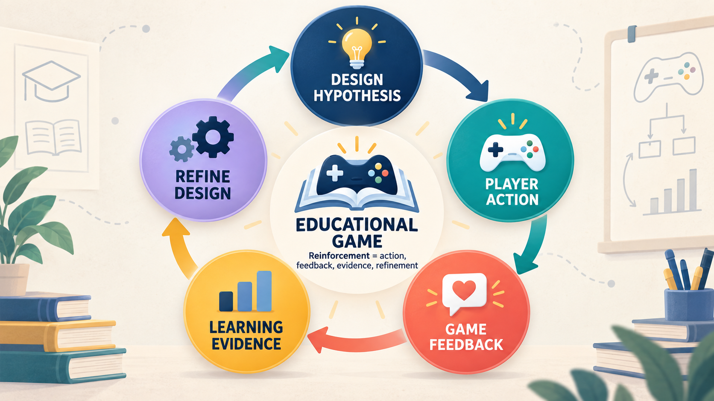

# game-design Skill

Evidence-driven game concept tournaments for educational, research, and serious games.

**Creator:** National Tsing Hua University, Professor Chih-Hung Wu  
**Version:** 1.2.0  
Copyright (c) National Tsing Hua University, Professor Chih-Hung Wu. All rights reserved.

[繁體中文 README](README.zh-TW.md)



Reinforcement in this Skill is a closed design loop: a hypothesis shapes player action, the game provides feedback, learning evidence is observed, and the design is refined before the next cycle.

## What it does

This Skill helps teams move from a design brief to multiple meaningfully different game concepts, blind review, hard-gate elimination, G/R/D scoring, educational reward diagnostics, human approval, visual directions, prototyping, and playtesting.

The formal execution entry point is [`SKILL.md`](SKILL.md). A complete Traditional Chinese reading version is available at [`references/zh-TW.md`](references/zh-TW.md).

## Install in Codex

The recommended installation is to clone this repository and run the included installer. The installer copies the Skill files into the Codex Skills directory and leaves the repository's README and installer outside the installed Skill.

### Windows quick install

Open PowerShell and run the following commands.

```powershell
git clone https://github.com/profchwu/game-design.git
cd game-design
.\INSTALL_SKILL.ps1
```

If `game-design` is already installed and you want to replace it with this version, run:

```powershell
.\INSTALL_SKILL.ps1 -Force
```

The default installation path is:

```text
%USERPROFILE%\.codex\skills\game-design\
```

To choose another Codex installation directory, pass an explicit destination.

```powershell
.\INSTALL_SKILL.ps1 -Destination "$env:USERPROFILE\.codex\skills\game-design" -Force
```

### macOS/Linux

Clone the repository, then copy the Skill contents into `~/.codex/skills/game-design/`.

```bash
git clone https://github.com/profchwu/game-design.git
cd game-design
```

Copy the complete Skill contents into:

```text
~/.codex/skills/game-design/
```

```bash
mkdir -p ~/.codex/skills/game-design
cp -R SKILL.md agents assets references scripts COPYRIGHT.md ~/.codex/skills/game-design/
```

The final path must end with `game-design/SKILL.md`. Restart Codex or reload the Skill list after installation.

## Validate

Run the Skill Creator validator against the installed folder:

```bash
python <path-to-skill-creator>/scripts/quick_validate.py ~/.codex/skills/game-design
```

The validator should report `Skill is valid!`.

## Included teaching materials

- [Teaching presentation (PPTX)](assets/Game-Design-Skill-教學簡報.pptx)
- [Course tasks and worksheet (DOCX)](assets/Game-Design-Skill-課程學習任務與學習單.docx)
- [`references/course-learning-tasks.md`](references/course-learning-tasks.md) — Markdown teaching guide
- [`assets/student-worksheet.md`](assets/student-worksheet.md) — student worksheet
- [`assets/instructor-rubric.md`](assets/instructor-rubric.md) — instructor rubric

## Companion capabilities

The Skill routes work to available companion capabilities such as Sites, visualization, image generation, Remotion, SVG/CSS/canvas, and browser testing. Background music and sound effects require licensed or user-provided assets unless a suitable audio-generation capability is available.

## Copyright and attribution

This Skill and its accompanying documentation, examples, diagrams, teaching materials, and worksheets were created by National Tsing Hua University, Professor Chih-Hung Wu.

Copyright (c) National Tsing Hua University, Professor Chih-Hung Wu. All rights reserved. See [`COPYRIGHT.md`](COPYRIGHT.md) for the distribution notice.
