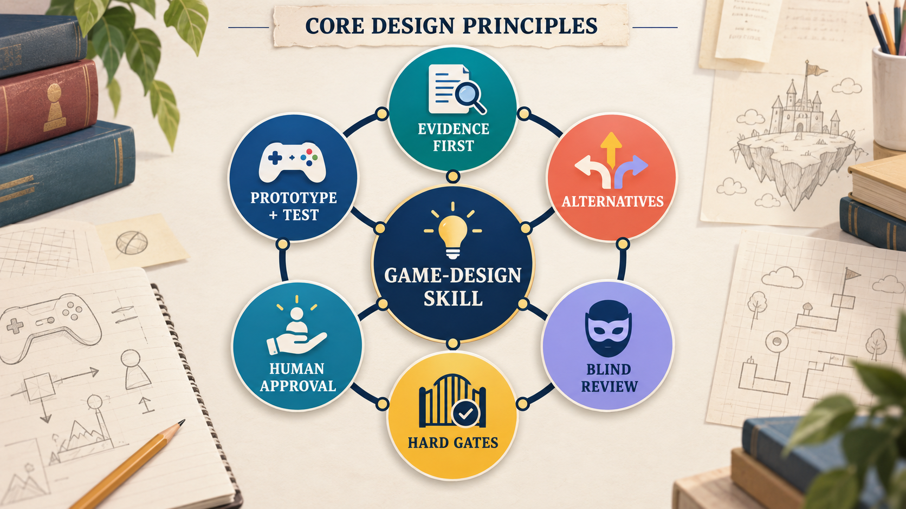

# game-design Skill｜繁體中文

本 Skill 以證據為基礎，透過遊戲概念競賽，支援教育遊戲、研究遊戲與嚴肅遊戲的設計。

**建立者：** 國立清華大學 吳智鴻教授（National Tsing Hua University, Professor Chih-Hung Wu）  
**版本：** 1.2.0  
Copyright (c) National Tsing Hua University, Professor Chih-Hung Wu. All rights reserved.

[English README](README.md)


本 Skill 所說的 Reinforcement 是一個封閉的設計循環：先提出設計假設，引導玩家行動，再由遊戲提供回饋，觀察學習證據，最後修正設計並進入下一輪。

## 核心設計理念



本 Skill 以六項相互連結的原則運作：

- **Evidence First（證據優先）：** 以學習者、領域知識與遊戲測試證據支持設計決策。
- **Alternatives（多方案）：** 先產生具有實質差異的概念，再進行選擇。
- **Blind Review（盲評）：** 依評分規準比較方案，不讓作者身分或表達風格影響判斷。
- **Hard Gates（硬性關卡）：** 淘汰不符合學習、安全、可行性或其他不可妥協限制的方案。
- **Human Approval（人類核准）：** 由教師、研究者或專案負責人保留關鍵決策權。
- **Prototype + Test（原型與測試）：** 先建立最小可用實驗，再用結果修正下一輪設計。

## 設計理念說明

好的教育遊戲設計應先從「學習主張」開始，而不是先決定遊戲機制。團隊要先說清楚學習者應該學會什麼，再把主張轉換成可觀察的玩家行動與遊戲回饋，最後用證據檢查遊戲是否真的教會了預期內容。

本 Skill 所說的 Reinforcement，是一個「設計與學習」的循環。獎勵或回饋只有在能幫助玩家看見行動後果、選擇更好的策略，並產生理解的證據時才有價值。玩家覺得好玩或停留時間很長，本身不能證明學習已經發生。

整個流程可以理解成四個動作：先擴大方案空間，再公平比較不同方案，透過硬性關卡淘汰失敗方案，最後從實際遊玩中學習並修正。AI 可以協助產生、整理、質疑方案，以及依評分規準預評；教師、研究者或專案負責人仍保留關鍵核准權。

檢查一個設計時，可以問：

- 玩家完成遊戲後，應該理解什麼或能夠做到什麼？
- 哪一個玩家行動可以提供學習證據？
- 回饋是否說明行動後果，並支持玩家做出更好的下一個決策？
- 什麼證據會讓我們保留、修改或停止這個設計？

## 功能

本 Skill 協助團隊從設計 brief 出發，產生多個具有實質差異的遊戲概念，進行盲評、硬性關卡淘汰、G/R/D 評分、教育獎勵函數診斷、人類核准、視覺方向選擇、原型製作與遊戲測試。

英文 `SKILL.md` 是唯一正式執行入口，完整繁體中文 Skill 參考版位於 [`references/zh-TW.md`](references/zh-TW.md)。

## 安裝到 Codex

建議先 clone 本 repository，再執行內附安裝程式。安裝程式會將 Skill 檔案複製到 Codex Skills 目錄，不會把 repository 的 README 與安裝腳本複製進已安裝的 Skill。

### Windows 快速安裝

開啟 PowerShell，執行以下指令：

```powershell
git clone https://github.com/profchwu/game-design.git
cd game-design
.\INSTALL_SKILL.ps1
```

如果已經安裝 `game-design`，要以目前版本取代原有版本，請執行：

```powershell
.\INSTALL_SKILL.ps1 -Force
```

預設安裝位置是 `%USERPROFILE%\.codex\skills\game-design\`。

若要指定其他 Codex 安裝目錄，可傳入自訂路徑：

```powershell
.\INSTALL_SKILL.ps1 -Destination "$env:USERPROFILE\.codex\skills\game-design" -Force
```

### macOS/Linux

先 clone repository，再將 Skill 內容複製到 `~/.codex/skills/game-design/`：

```bash
git clone https://github.com/profchwu/game-design.git
cd game-design
mkdir -p ~/.codex/skills/game-design
cp -R SKILL.md agents assets references scripts COPYRIGHT.md ~/.codex/skills/game-design/
```

安裝後的最終路徑必須包含 `game-design/SKILL.md`。完成安裝後，請重新啟動 Codex 或重新載入 Skill 清單。

## 驗證

對已安裝的資料夾執行 Skill Creator validator：

```bash
python <path-to-skill-creator>/scripts/quick_validate.py ~/.codex/skills/game-design
```

驗證器應回報 `Skill is valid!`。

## 內附教學教材

- [`assets/Game-Design-Skill-教學簡報.pptx`](assets/Game-Design-Skill-教學簡報.pptx) — 教學簡報
- [`assets/Game-Design-Skill-課程學習任務與學習單.docx`](assets/Game-Design-Skill-課程學習任務與學習單.docx) — 課程任務與學習單
- [`references/course-learning-tasks.md`](references/course-learning-tasks.md) — Markdown 教學指南
- [`assets/student-worksheet.md`](assets/student-worksheet.md) — 學生工作表
- [`assets/instructor-rubric.md`](assets/instructor-rubric.md) — 教師評分規準

## 可搭配的 Skill

以下 Skill 可在已安裝且符合任務需要時，與 `game-design` 搭配使用：

- **設計與交付：** `dt`、`dt-sdlc`、`sdlc`
- **視覺探索：** `imagegen`、`visualize:visualize`
- **影片與動態：** `remotion-best-practices`
- **網站與原型交付：** `sites:sites-building`、`computer-use:computer-use`
- **文件與教學教材：** `presentations:Presentations`、`documents:documents`
- **音訊：** 使用具授權的背景音樂與音效，或使用者提供的素材。本 repository 沒有內附專用的音訊生成 Skill。

這些 Skill 是 `game-design` 的配套能力，不會取代其證據、競賽、硬性關卡與人類核准流程。

## 著作權與署名

本 Skill 及其文件、範例、圖表、教學教材與學習單由國立清華大學 吳智鴻教授開發。

Copyright (c) National Tsing Hua University, Professor Chih-Hung Wu. All rights reserved. 完整發布聲明請見 [`COPYRIGHT.md`](COPYRIGHT.md)。
